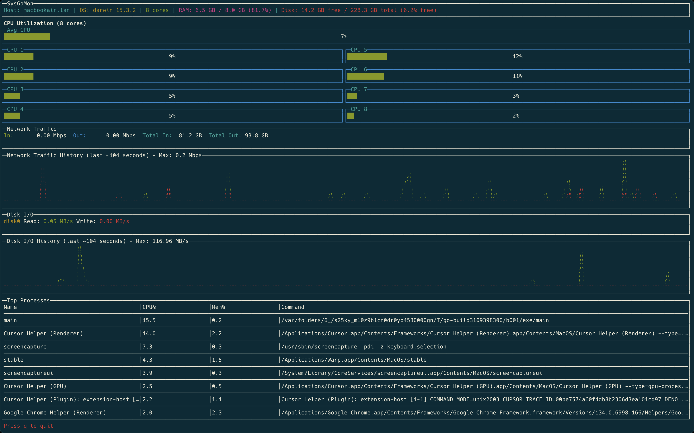

# SysGoMon

A beautiful and efficient terminal-based system monitoring tool written in Go. SysGoMon provides real-time monitoring of system resources with a modern, responsive interface that adapts to both light and dark terminal themes.



## Features

- **CPU Monitoring**
  - Real-time CPU usage for each core
  - Smooth animated gauges with color-coded indicators
  - Average CPU usage across all cores

- **Network Monitoring**
  - Real-time network traffic (in/out)
  - Historical network traffic graph
  - Total network usage statistics
  - Auto-scaling graph with maximum value tracking

- **Disk I/O Monitoring**
  - Real-time disk read/write speeds
  - Historical disk I/O graph
  - Per-disk statistics
  - Auto-scaling graph with maximum value tracking

- **Process Monitoring**
  - Top processes by CPU usage
  - Memory usage per process
  - Command-line information
  - Auto-adjusting column widths

- **Modern UI Features**
  - Responsive layout that adapts to terminal size
  - Automatic light/dark theme detection
  - Smooth animations for all metrics
  - Color-coded indicators for different usage levels
  - Clean, organized information display

## Installation

### Prerequisites

- Go 1.16 or later
- A terminal that supports ANSI colors and Unicode characters

### Building from Source

1. Clone the repository:
   ```bash
   git clone https://github.com/samirspatel/sysgomon.git
   cd sysgomon
   ```

2. Build the application:
   ```bash
   go build
   ```

3. Run the application:
   ```bash
   ./sysgomon
   ```

### Using Go Install

```bash
go install github.com/samirspatel/sysgomon@latest
```

## Usage

1. Launch SysGoMon:
   ```bash
   sysgomon
   ```

2. The interface will automatically adjust to your terminal size and theme.

3. To quit the application, press `q` or `Ctrl+C`.

## Keyboard Shortcuts

- `q` or `Ctrl+C`: Quit the application

## Dependencies

- [termui](https://github.com/gizak/termui) - Terminal UI library
- [gopsutil](https://github.com/shirou/gopsutil) - System and process utilities

## Contributing

Contributions are welcome! Please feel free to submit a Pull Request.

## License

This project is licensed under the MIT License - see the [LICENSE](LICENSE) file for details.

## Author

Samir Patel - [@samirspatel](https://github.com/samirspatel)

## Acknowledgments

- Inspired by various system monitoring tools
- Built with [termui](https://github.com/gizak/termui) and [gopsutil](https://github.com/shirou/gopsutil) 